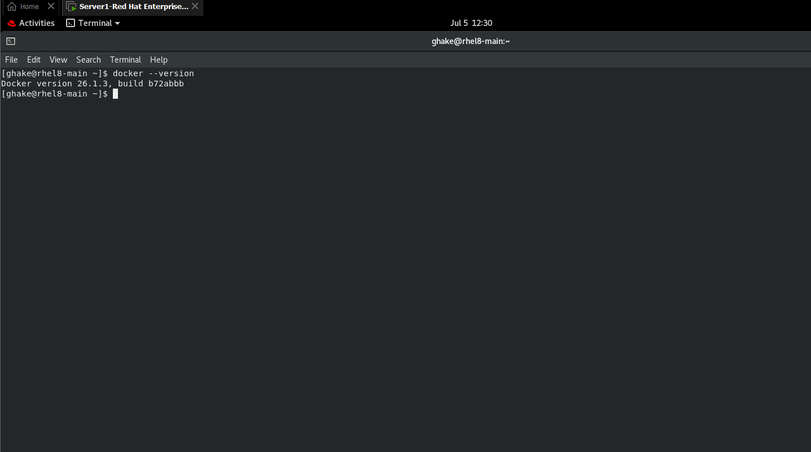
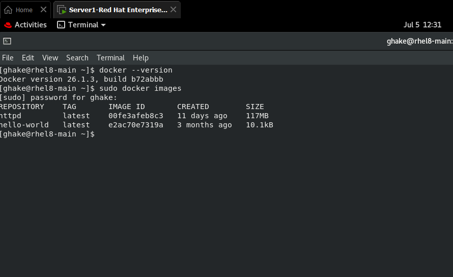
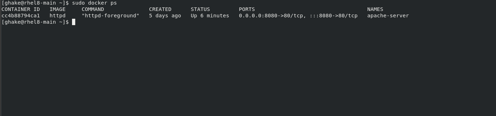
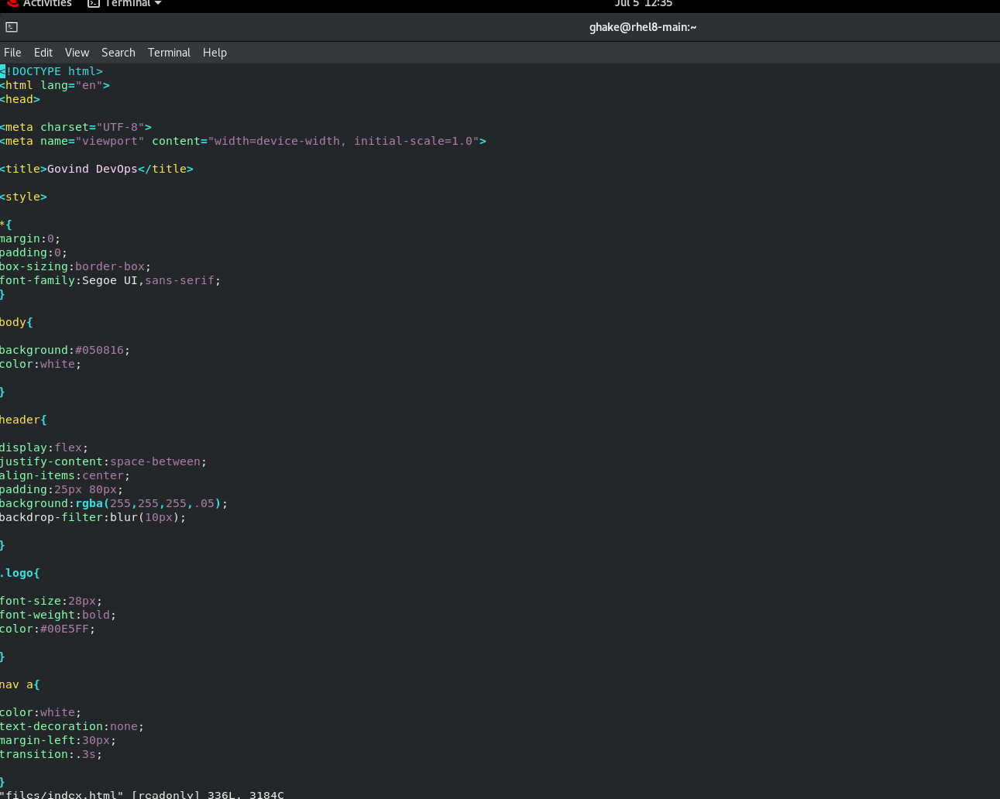
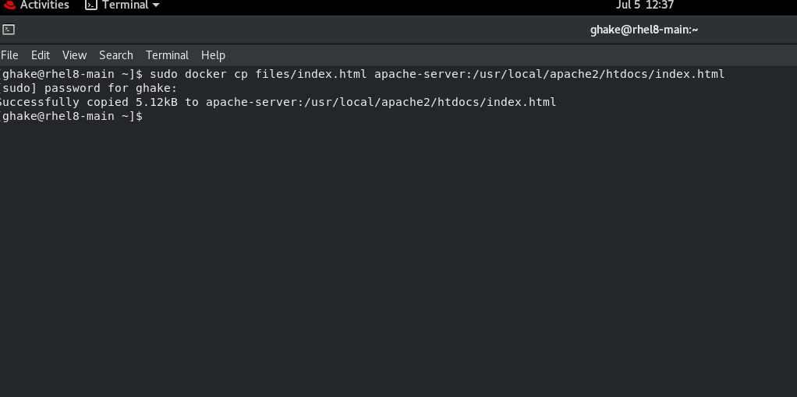
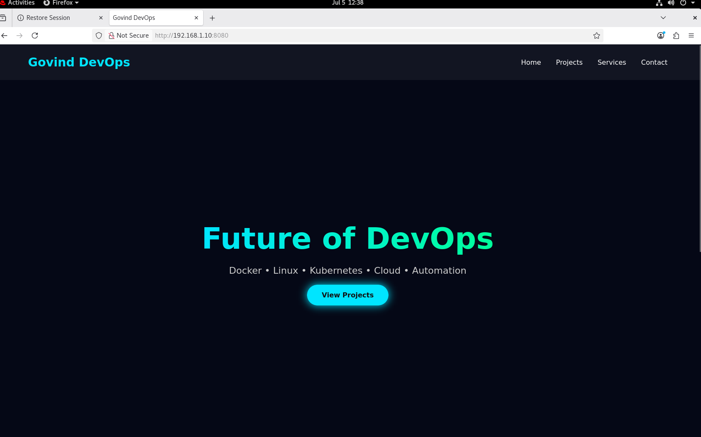

# Docker Apache Web Server Deployment on Red Hat Enterprise Linux 8

## Project Overview

This project demonstrates how to deploy an Apache HTTP Server inside a Docker container on Red Hat Enterprise Linux 8 (RHEL 8). It includes Docker installation, Apache container deployment, port mapping, and deployment of a custom HTML webpage.

---

## Objective

The objective of this project is to learn containerization using Docker by deploying an Apache web server and hosting a custom website inside a Docker container.

---

## Technologies Used

* Red Hat Enterprise Linux 8 (RHEL 8)
* Docker
* Apache HTTP Server (httpd)
* HTML
* Git & GitHub

---

## Project Structure

```text
docker-apache-project/
├── files/
│   └── index.html
├── screenshots/
│   ├── Docker_version.png
│   ├── Docker_images.png
│   ├── Docker_container.png
│   ├── custom-index-html.png
│   ├── docker-copy-command.png
│   └── custom-website-output.png
└── README.md
```

---

## Prerequisites

* Red Hat Enterprise Linux 8
* Docker installed
* Internet connectivity
* Sudo privileges

---

## Docker Installation

Verify Docker installation:

```bash
sudo docker --version
```

### Screenshot



---

## Pull Apache Image

```bash
sudo docker pull httpd
```

Verify available images:

```bash
sudo docker images
```

### Screenshot



---

## Run Apache Container

```bash
sudo docker run -dit --name apache-server -p 8080:80 httpd
```

Verify the running container:

```bash
sudo docker ps
```

### Screenshot



---

## Create Custom Website

Create the HTML file:

```bash
vi files/index.html
```

### Screenshot



---

## Copy Website into Container

```bash
sudo docker cp files/index.html apache-server:/usr/local/apache2/htdocs/index.html
```

### Screenshot



---

## Verify Website

Open your browser:

```text
http://localhost:8080
```

or

```text
http://<server-ip>:8080
```

### Screenshot



---

## Docker Commands Used

```bash
sudo docker --version
sudo docker pull httpd
sudo docker images
sudo docker run -dit --name apache-server -p 8080:80 httpd
sudo docker ps
sudo docker cp files/index.html apache-server:/usr/local/apache2/htdocs/index.html
```

---

## Skills Learned

* Docker Installation
* Docker Images
* Docker Containers
* Apache HTTP Server Deployment
* Port Mapping
* Custom Website Deployment
* Linux Administration
* GitHub Project Documentation

---

## Project Outcome

Successfully deployed an Apache HTTP Server inside a Docker container on Red Hat Enterprise Linux 8. A custom HTML webpage was hosted using Docker, demonstrating container management, web server deployment, and basic DevOps practices.

